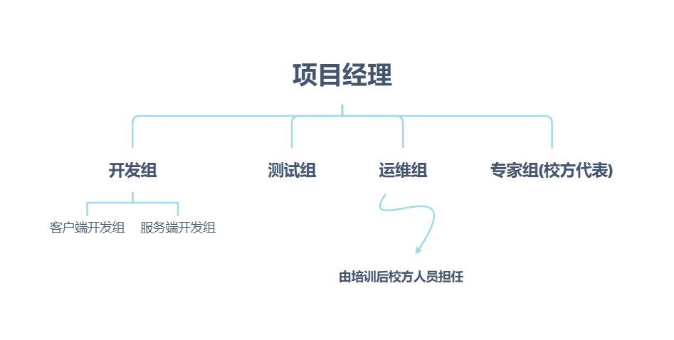

## 项目管理计划书

### *项目概述*

**项目名称**：“我的大学”移动客户端

**项目目的**：为师生日常教学任务和日常事务处理提供便捷服务

**项目定位**：课程学习助手，非社交

**项目系统**：本项目一共分为“即时文字通信业务”、“即时视频通信业务”、“文件存储业务”和“插件系统”四个主要子业务系统。其中，即时通讯和文件存储业务为软件核心功能，插件系统的内容需要根据后续需求分析决定。

**项目开发过程**：需求收集与分析、系统设计、系统开发、系统测试以及最后的测试交付

**项目关键里程碑**：

- 项目管理计划书的制定
- 需求规格说明书的制定
- 系统设计报告的制定
- 第一版开发版本的软件发布
- 生产版本的软件发布

**项目时间**：2020-01-01始，2020-06-01终。

**项目预算**：该项目预算为30万人民币，可根据需要增资。项目的主要成本为内部人工费用。所需硬件由校方自行提供。

### *项目组织*

**组织结构图**：

**项目角色及职责**：

| 姓名 |    角色    |   职责   |              联系方式               |
| :--: | :--------: | :------: | :---------------------------------: |
|  AA  |   发起人   |   CEO    | [AA@email.com](mailto:AA@email.com) |
|  BB  |  项目经理  |   经理   | [BB@email.com](mailto:BB@email.com) |
|  CC  | 项目组成员 | 校方代表 | [CC@email.com](mailto:CC@email.com) |
|  DD  | 项目组成员 | 测试专家 | [DD@email.com](mailto:DD@email.com) |
|  EE  | 项目组成员 |  程序员  | [EE@email.com](mailto:EE@email.com) |
|  FF  | 项目组成员 |  程序员  | [FF@email.com](mailto:FF@email.com) |

### *控制过程计划*

**启动计划**：

- 软硬件环境：开发过程由小组提供，运行过程由校方提供
- 人员估算：开发组负责客户端和服务端开发，至少2人；测试组负责日常测试和最终测试且与开发组进度同步，至少1人；运维组为实际用户使用，成员为培训后校方人员；专家组为各自领域的专家，负责把控各个环节的专业意见，至少1个校方代表。

**工作计划**：每周工作5天，持续半年。针对各自分组进行对应工作。

**沟通计划**：每周一早开周会，就上一周工作进行总结，并对本周工作进行适当指导。小组内每周至少一次的组内会议。

**进度计划**：

- 2020-05-01 前完成第一版移动客户端的开发
- 2020-06-01 前完成生产版本移动客户端的开发

**预算计划**：按5人算，人均10k/月，共持续6个月。

**风险计划**：小风险事件(软件运行出错等问题)由小组组长指导，中风险事件(系统总体需求、设计变更等问题)由项目经理指导，大风险事件(项目失败、项目延期等问题)由CEO指导。

**WBS**：

### *技术过程计划*

**项目架构**：C/S开发架构

**基础设施**：校方提供软件最终运行环境，并根据用户使用手册进行部署指导

**产品验收**：最终由测试组测试后提供可交付产品，并由校方验收

### *支持过程计划*

**项目关键文档**：项目章程、项目管理计划、验收报告、用户使用手册、合同、法律文件

**阶段文档**：可行性报告、需求规格说明书、设计报告、接口文档、测试文档

**日常文档**：会议报告