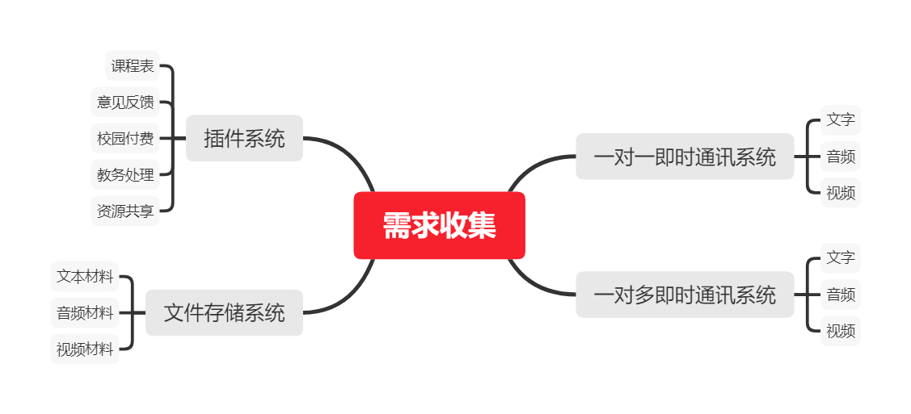

## 初步需求调查

### 专家判断

- 市面上类似的软件较多，因此项目开发迫切性不高
- 市面上软件功能参次不齐，不能很好的贴近实际校园实际生活，且拥有安全隐患，因此项目开发有其必要性
- 需要提前准备软件运行的硬件环境和软件环境
- 需要了解项目开发可能涉及的法律条文
- 根据相关方需求开展项目，尤其从学生视角，因为其用户体验、使用量将直接决定项目成败

### 数据收集

通过焦点小组(开发小组、校方代表、老师代表、学生代表)、问卷调查(主要为学生调查)、标杆对照(对市面上相似类型的即时通讯软件、会议软件、网络存储软件、项目管理软件、企业软件进行调查比对)

- 校方视角
  - 与校方已有数据库打通
  - 能够进行教务管理
  - 能够进行意见收集
- 老师视角
  - 能够方便的发放材料
  - 能够方便的收集作业
  - 能够方便的进行线上课程(文字、音频、视频)
  - 能够方便的查看课程表
  - 能够方便的进行校园付费
  - 能够方便的进行教务事务处理
- 学生视角
  - 能够方便的进行班级(行政班级和课程班级)沟通(文字、音频、视频)
  - 能够方便的进行小组(课程小组和活动小组)沟通(文字、音频、视频)
  - 能够方便的进行一对一沟通(文字、音频、视频)
  - 能够方便的进行课程材料获取
  - 能够方便的进行线上作业
  - 能够方便的查看课程表
  - 能够方便的进行校园付费
  - 能够方便的进行教务事务处理
  - 能够方便的进行资源共享
  - 能够方便的进行意见反馈且能得到答复

### 数据分析

- 一个一对一即时沟通业务(文字、音频、视频)
- 一个一对多即时沟通业务(文字、音频、视频)
- 一个文件存储系统，主要为课程材料，包括课件、试卷、阅读材料、作业收发等
- 一个查插件系统，连接校方数据库，比如课程表、教务处理、意见反馈、失物招领等

### 决策

采用独裁决策方法。分析可知，前三者为项目核心业务，插件系统可根据重要程度排名进行部分开发，并由后续更新逐步添加新功能

### 数据展示

